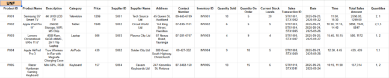
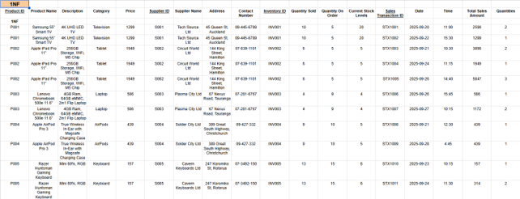
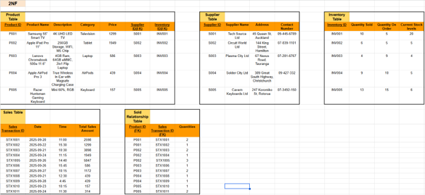
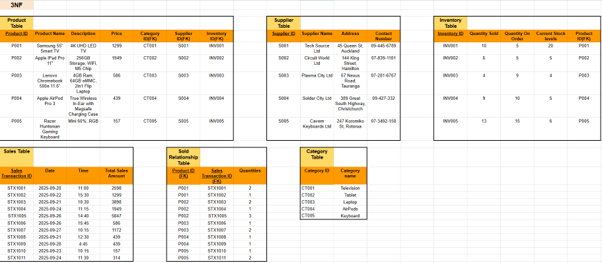

# Inventory Management Database System


A relational database developed for **Bright Sparks Ltd**, a fictional electronics retailer, to improve inventory management, supplier administration and sales reporting.

---

## Project Overview

This project was completed as part of the **New Zealand Diploma in Information Technology (Level 4)**.

The database was designed and implemented using **MySQL**, with a **LibreOffice Base** front-end providing forms, queries and reports. It demonstrates the complete process of analysing business requirements, designing a relational database and delivering a working solution.

---

## Features

- Relational MySQL database
- Entity Relationship Diagram (ERD)
- Database Normalisation (UNF → 3NF)
- Product Management
- Supplier Management
- Inventory Tracking
- Sales Recording
- SQL Queries
- Reports
- Role-based Permissions

---

## Technologies

| Technology | Purpose |
|------------|---------|
| MySQL 8 | Database Management System |
| SQL | Data Definition & Queries |
| LibreOffice Base | User Interface |
| Git | Version Control |
| GitHub | Portfolio Hosting |

---

# Database Design

## Entity Relationship Diagram


The database was designed using relational database principles and normalised from **UNF through to Third Normal Form (3NF)** to minimise redundancy and maintain data integrity.

Additional design documentation is available in the **diagrams** and **docs** folders.

---

## Database Normalisation

| Stage | Diagram |
|-------|---------|
| UNF |  |
| 1NF |  |
| 2NF |  |
| 3NF |  |

---

## Project Structure

```text
inventory-management-database
│
├── assets/
├── database/
├── diagrams/
├── docs/
├── screenshots/
├── CHANGELOG.md
├── LICENSE
├── README.md
└── .gitignore
```

---

## Documentation

Project documentation is located in the **docs** folder.

- Executive Summary
- Company Overview
- Business Case
- Project Objectives
- Requirements Analysis
- Project Planning
- Database Design
- Database Implementation
- Testing & Evaluation
- Reflection
- Future Development

---

## Database Export

The complete MySQL database is included.

```text
database/
└── BrightSparks_Database.sql
```

---

## Screenshots

Project screenshots can be found in the **screenshots** folder and include:

- Forms
- Reports
- SQL Queries
- Database Tables
- Application Interface

---

## Future Improvements

Future versions of the project could include:

- Web-based interface
- Barcode scanning
- Secure authentication
- Inventory dashboard
- Automated stock alerts
- Cloud deployment

---

## Author

**Deacon George**

GitHub: https://github.com/deacongeorgenz
